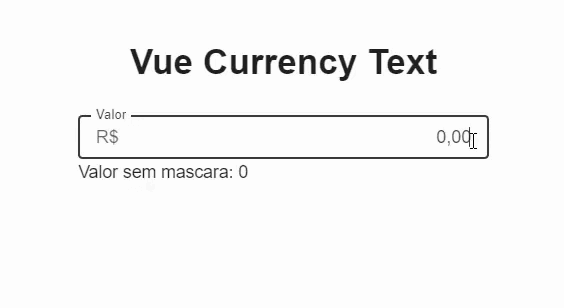

# Vue-Currency-Text
Um componente de moeda com as funcionalidades do v-text-field. O componente é compatível com Vuetify 3.x.
## Install 
#### NPM 
Para usar o componente em seu projeto Vue 3, instale o pacote via NPM:

```bash 
npm install v-currency-text 
``` 
## Uso
No seu projeto Vue, importe e registre o componente:

```javascript 
import { createApp } from 'vue';
import App from './App.vue';
import vuetify from './plugins/vuetify';  // if you are already using Vuetify 
import VCurrencyText from 'v-currency-text';

const app = createApp(App);

app.use(vuetify);
app.component('VCurrencyText', VCurrencyText);
app.mount('#app');
```
## Exemplo de Uso
Você pode usar o componente da seguinte maneira:

```vue
<template>
<v-currency-text
v-model="value"
name="value"
prefix="R$"
density="compact"
variant="outlined"
:value="value"
@changing="v => value = v"
ref_currency="value"
id="value"
label="Value"
v-bind="precision"
hide-details
/>
</template>

<script>
export default {
data() {
return {
value: 0, 
  precision: {
      decimal: ',',
      thousands: '.',
      prefix: '',
      suffix: '',
      precision: 2,
      masked: false,
      allowBlank: false,
      min: Number.MIN_SAFE_INTEGER,
      max: Number.MAX_SAFE_INTEGER
    },
}; 
},
};
</script>
```
#### Props
* v-model: Controla o valor do input.
* name: Define o nome do campo, usado em formulários.
* prefix: Prefixo da moeda (Ex: "R$").
* density: Define a densidade do campo, controlando o espaçamento. (Ex: "compact", "default").
* variant: Estilo do campo. (Ex: "outlined", "filled").
* value: O valor atual do input.
* @changing: Evento emitido quando o valor muda, retornando o novo valor.
* ref_currency: Referência interna para o campo monetário.
* id: ID do elemento, útil para associar labels ou acessibilidade.
* label: Texto que será exibido como rótulo do campo.
* v-bind: Usado para passar configurações adicionais, como precisão (decimal).
* hide-details: Oculta detalhes adicionais do campo, como mensagens de erro.

#### Events
* @change: Emite o novo valor monetário sempre que o campo for alterado.

#### Slots
Este componente atualmente não utiliza slots.

#### Referências
* https://github.com/jonathanpmartins/v-money3 (based on v-money)
